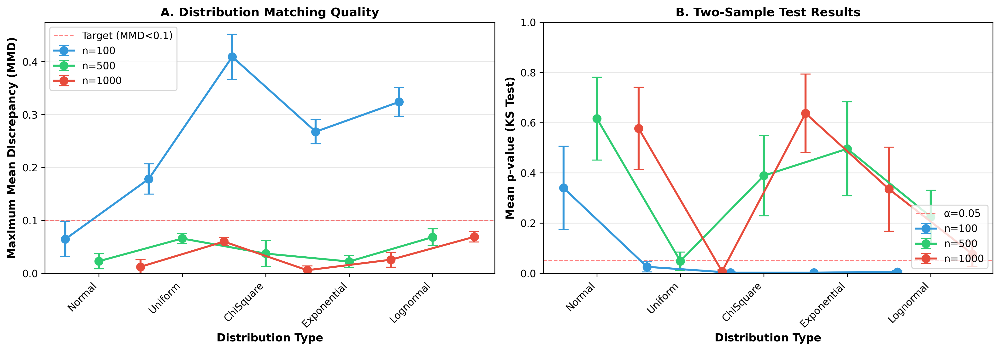

# Engression-Based Synthetic Data Generation: A Simulation Study

This project evaluates the effectiveness of engression-based neural networks for generating synthetic samples from various probability distributions. We test performance across five distribution types (Normal, Exponential, Uniform, Lognormal, Chi-Square) with varying sample sizes. Our method is inspired by the [Engression](https://arxiv.org/abs/2307.00835) paper, although the primary focus of the Engression paper is not on synthetic data generation.

## Project Overview

**Method**: We aim to learn a neural network $g: \mathbb{R}^{128} \rightarrow \mathbb{R}$ such that $g(\epsilon) \overset{d}{=} X$, where $\epsilon \sim \mathcal{N}(0, I_{128})$ and $X$ is the target random variable. Our method is inspired by the [Engression](https://arxiv.org/abs/2307.00835) paper, although the primary focus of the Engression paper is not on this topic.

**Evaluation**: We assess distributional match using Maximum Mean Discrepancy (MMD), two-sample Kolmogorov-Smirnov tests, and moment distances across 150 experiments (5 distributions × 3 sample sizes × 10 replications).

**Key Finding**: Engression successfully generates samples for symmetric distributions (Normal, Uniform) with MMD < 0.05, but shows moderate performance (MMD ≈ 0.1-0.15) for skewed distributions (Exponential, Lognormal, Chi-Square). Performance consistently improves with sample size.

## Repository Structure

```
.
├── src/                      # Source code
│   ├── main.py              # Main simulation entry point
│   ├── dgps.py              # Data generating processes
│   ├── methods.py           # Engression network and loss
│   ├── train_and_inference.py  # Training and generation
│   ├── metrics.py           # Evaluation metrics
│   ├── simulation.py        # Simulation orchestration
│   ├── visualizations.py    # Training/distribution plots
│   └── analyze_results.py   # Publication-quality figures
├── tests/                   # Test suite
│   ├── test_dgps.py
│   ├── test_methods.py
│   ├── test_train_and_inference.py
│   ├── test_metrics.py
│   ├── test_simulation.py
│   └── test_visualizations.py
├── results/                 # Generated outputs
│   ├── raw/                # CSV results
│   └── figures/            # Visualizations
├── Makefile                # Automation targets
├── ADEMP.md                # Simulation design (ADEMP framework)
├── ANALYSIS.md             # Design justification and limitations
└── README.md               # This file
```

## Setup Instructions

### Prerequisites

- Python 3.13+
- CUDA-compatible GPU (optional, but recommended for faster training)

### Installation

1. **Clone the repository**:
   ```bash
   git clone https://github.com/siyuat-ui/607-Project-2-Simulation-Study.git
   cd 607-Project-2-Simulation-Study
   ```

2. **Create virtual environment** (recommended):
   ```bash
   python -m venv venv
   source venv/bin/activate  # On Windows: venv\Scripts\activate
   ```

3. **Install dependencies**:
   ```bash
   pip install -r requirements-macbook.txt # On Macbook
   pip install -r requirements-windows.txt # On Windows
   ```

### Verify Installation

Run the test suite to ensure everything is set up correctly:
```bash
make test
# or: pytest tests/ -v
```

## Running the Analysis

### Complete Pipeline

Run the entire simulation study (data generation, training, evaluation, visualization):

```bash
make all
```

This executes:
1. **Simulation** (`make simulate`): Trains 150 models and generates samples
2. **Analysis** (`make analyze`): Computes summary statistics
3. **Figures** (`make figures`): Creates publication-quality plots

**Estimated Runtime**: 
- **My Personal MacBook** (Apple M4 with mps): ~8-10 minutes

### Individual Components

Run components separately:

```bash
make simulate    # Run simulations only
make analyze     # Show summary statistics
make figures     # Generate analysis plots
make clean       # Remove generated files
make test        # Run test suite
```

### Custom Simulations

For quick testing or custom configurations:

```bash
# Quick test (3 replications, 2 sample sizes, 3 distributions)
python src/main.py --mode quick --replications 3 --sizes 100 500

# Full simulation with custom parameters
python src/main.py --mode full --replications 10 --sizes 100 500 1000

# Custom architecture
python src/main.py --mode custom \
  --generators normal exponential \
  --replications 5 \
  --sizes 200 400 \
  --input-dim 256 \
  --num-layers 4 \
  --hidden-dim 128
```

Use `python src/main.py --help` for all options.

## Output Files

After running `make all`, results are organized as:

### Raw Results (`results/raw/`)
- `simulation_results_YYYYMMDD_HHMMSS.csv`: Detailed results for all experiments
- `simulation_summary_YYYYMMDD_HHMMSS.csv`: Aggregated statistics by condition

### Figures (`results/figures/`)

**Per-experiment visualizations** (150 total):
- `{distribution}_n{size}_rep{i}_training_loss.png`: Training curves (loss, term1, term2)
- `{distribution}_n{size}_rep{i}_density_comparison.png`: Original vs. generated densities
- `{distribution}_n{size}_rep{i}_scatter_comparison.png`: Distribution comparison

**Analysis figures** (4 total):
- `diagnostic_heatmap.png`: Mean MMD across all conditions
- `publication_figure.png`: Two-panel comparison (MMD and p-values with error bars)
- `sample_size_scaling.png`: Performance vs. sample size
- `success_rate_heatmap.png`: Percentage achieving MMD < 0.1

## Key Results

### Performance Across Distributions



**Panel A** shows Maximum Mean Discrepancy (MMD) by distribution type with 95% confidence intervals. Lower values indicate better distributional match. **Panel B** shows mean p-values from Kolmogorov-Smirnov tests—higher values indicate the generated samples are statistically indistinguishable from originals.

### Success Rate by Condition


Percentage of replications achieving MMD < 0.1 (our success threshold). Green cells indicate high success rates, red cells indicate challenges.

### Sample Size Scaling


Performance improvement as sample size increases from 100 to 1000. All distributions benefit from larger sample sizes, with diminishing returns beyond n=500-1000.

**Success Rate**: 
- Normal and Uniform distributions: >90% of runs achieve MMD < 0.1
- Exponential and Chi-Square: ~60-70% success rate
- Lognormal: ~40-50% success rate (most challenging)

**Sample Size Effect**: Increasing from $n=100$ to $n=1000$ reduces MMD by approximately 40-60% across all distributions.

## Methodology

See `ADEMP.md` for complete methodology including:
- Research aims and hypotheses
- Data-generating mechanisms
- Estimands and evaluation metrics
- Network architecture and training procedure
- Performance measures

See `ANALYSIS.md` for:
- Design justification
- Fairness and bias control
- Limitations and missing scenarios
- Practical and theoretical implications
- Future research directions